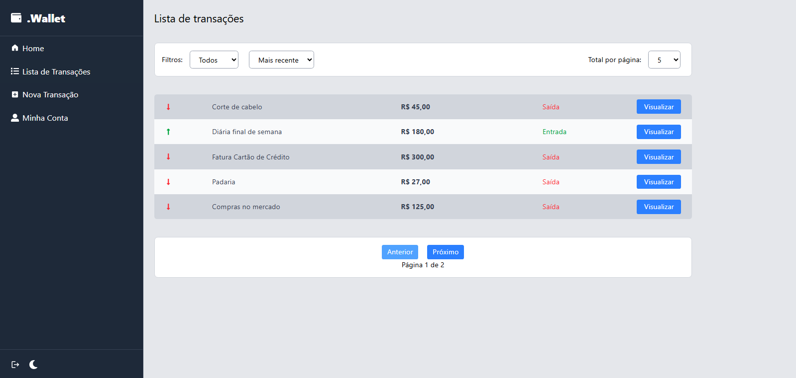

# 🚀 .Wallet - Controle de finanças pessoais (V2) - React JS
Este projeto é um App de controle de finanças pessoais, desenvolvido como parte de um estudo evolutivo sobre Desenvolvimento Web. Após a V2 (desenvolvida com React JS e persitência local), esta V3 foca na migração para arquitetura cliente/servidor.

*Segue link do repositório GITHUB da API*:
[☁️ Clique aqui!](https://github.com/myckijeffreeisema/my-wallet-v3-api)

## 📸 Preview


## 🔥 Funcionaliodades desta versão
- 🔒 Autenticação via JWT (json web token)
- ✅ Cadastro, exibição, edição e remoção de transações (CRUD)
- 📊 Cálculo automático de entradas, saídas e saldo
- 🔎 Listagem de transações com ``paginação``, ``filtros`` e ``ordenação``
- ⚡ Atualização dinâmica da interface (sem reload)


## 🛠️ Tecnologias
- ``React JS`` (Como biblioteca base da interface)
- ``Vite`` (Para um ambiente de desenvolvimento rápido)
- ``Tailwind CSS`` (Para estilização rápida com classes utilitárias)
- ``Sonner`` (Para os pop-ups de notificação/toasts)
- ``Recharts`` (Para criação de gráfico)


## 📂 Estrutura de pastas

``` bash
## 📁 Estrutura do Projeto

```text
src/
├── assets/          # Arquivos estáticos (imagens, gifs, etc.)
├── components/      # Componentes reutilizáveis da interface (botões, formulários)
├── context/         # Definições de Contexto da Context API (Autenticação, Tema)
├── helper/          # Funções utilitárias e requisições de API (Axios/Fetch)
├── hooks/           # Custom Hooks para isolar a lógica dos componentes
├── pages/           # Páginas/Telas principais da aplicação (Dashboard, Login)
└── providers/       # Provedores de contexto que envolvem a aplicação

```


## ▶️ Como executar
``` bash

# Clone o repositório

git clone https://github.com/myckijeffreeisema/my-wallet-v3.git


# Acesse a pasta do projeto
cd my-wallet-v3


# Instale as dependências
npm install

# Inclua a URL BASE da API no seu arquivo .env
# Inicie o servidor de desenvolvimento
npm run dev

```