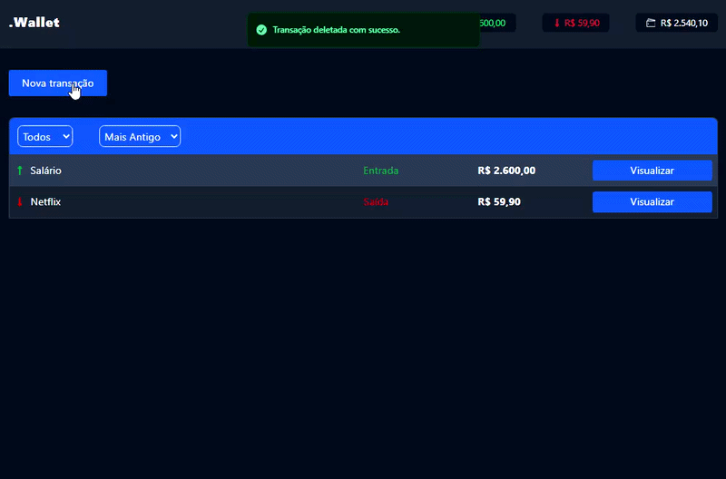

# 🚀 .Wallet - Controle de finanças pessoais (V2) - React JS

Este projeto é um App de controle de finanças pessoais, desenvolvido como parte de um `estudo evolutivo` sobre `Desenvolvimento Web`. Após a V1 (desenvolvida em Vanilla JS), esta V2 foca na migração para o ecossistema do React JS, explorando componentização, gerenciamento de estado e estilização utilitária.

## 📸 Preview



## 🔥 Funcionalidades desta versão
- ✅ Cadastro, exibição, edição e remoção de transações (CRUD)
- 📊 Cálculo automático de entradas, saídas e saldo
- 🔎 Listagem de transações com filtros e ordenação
- 💾 Persistência de dados com LocalStorage
- ⚡ Atualização dinâmica da interface (sem reload)


## 🛠️ Tecnologias
- ``React JS`` (Como biblioteca base da interface)
- ``Vite`` (Para um ambiente de desenvolvimento rápido)
- ``Tailwind CSS`` (Para estilização rápida com classes utilitárias)
- ``Sonner`` (Para os pop-ups de notificação/toasts)

## 🧠 Conceitos aplicados
- **Pensamento Declarativo:** Transição do controle manual do DOM (imperativo V1) para o controle baseado  em estados (declarativo).
- **Componentização:** Divisão do projeto em blocos menores, isolados, reutilizáveis e com responsabilidade única.
- **Gerenciamento de Estado Centralizado:** Uso do hook `useState` no componente pai para coordenar o fluxo de dados unidirecional.
- **Efeitos Colaterais (`useEffect`):** Sincronização do estado do React com o armazenamento assíncrono do LocalStorage.


## 📂 Estrutura de Pastas

```text

src/

├── assets/
├── components/
│   ├── Header.jsx
│   ├── ListTransactions.jsx
│   ├── AddTransactionForm.jsx
│   ├── AddTransactionButton.jsx
│   └── TransactionModal.jsx
├── hooks/
│   ├── helper.js
│   ├── storage.js
│   └── transactionService.js
├── App.jsx
└── main.jsx

```

## ▶️ Como executar

``` bash

# Clone o repositório

git clone https://github.com/myckijeffreeisema/my-wallet-v2.git


# Acesse a pasta do projeto
cd my-wallet-v2


# Instale as dependências
npm install


# Inicie o servidor de desenvolvimento
npm run dev

``` 

