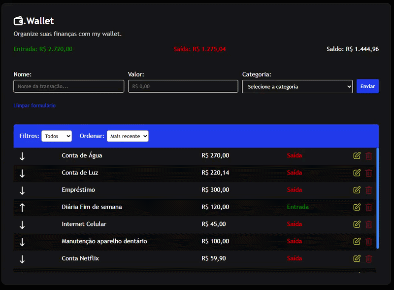

# 🚀 .Wallet - Controle de finanças pessoais (V1) - Vanilla JS

Este projeto é um App de controle de finanças pessoais, desenvolvida como parte de um ``estudo evolutivo`` sobre ``Desenvolvimento Web`` com foco em arquitetura de software, organização de código e manipulação de Estado.

## 📸 Preview



## 🔥 Funcionalidades desta versão
- ✅ Cadastro, edição e remoção de transações (CRUD)
- 📊 Cálculo automático de:
    - Entradas
    - Saídas
    - Saldo total
- 🔎 Listagem de transações com filtros e ordenação
- 💾 Persistência de dados com LocalStorage
- ⚡ Atualização dinâmica da interface (sem reload)


## 🛠️ Tecnologias
- HTML5 / CSS3
    - Flexbox
- JavaScript (ES6+)
    - Manipulação de Array (filter, map, find, reduce, toSorted, etc)
    - Event Delegation
    - module (``import/export``)


## 🧠 Conceitos aplicados

- Arquitetura modular em JavaScript
- Gerenciamento de estado centralizado
- Sincronização entre UI e persistência
- Manipulação avançada do DOM
- Boas práticas de UX com feedback visual


## 📂 Estrutura de Pastas
    index.html
    assets/
    js/
    ├── main.js
    ├── listener.js
    ├── service.js
    ├── storage.js
    ├── ui.js
    ├── formatter.js
    └── util.js
    css/
    ├── app.css

## 🏗️ Arquitetura

O projeto segue uma separação clara de responsabilidades:

- `service.js` → regras de negócio
- `storage.js` → persistência (LocalStorage)
- `ui.js` → manipulação do DOM
- `listener.js` → eventos
- `formatter.js` → formatação de dados
- `main.js` → ponto de entrada e orquestração


## 🚧 Desafios enfrentados
- Garantir consistência entre estado, UI e persistência
- Evitar acoplamento entre lógica e interface
- Criar renderização dinâmica eficiente sem frameworks
- Manter organização do código com crescimento do projeto

## ▶️ Como executar

```bash
# Clone o repositório
git clone https://github.com/myckijeffreeisema/my-wallet-v1.git

# Acesse a pasta
cd my-wallet-v1

# Abra o index.html no navegador ou use a extensão Live
```

## 🚀 Próximas melhorias
- [ ] Migrar para TypeScript
- [ ] Criar gráficos de despesas
- [ ] Melhorar a interface
